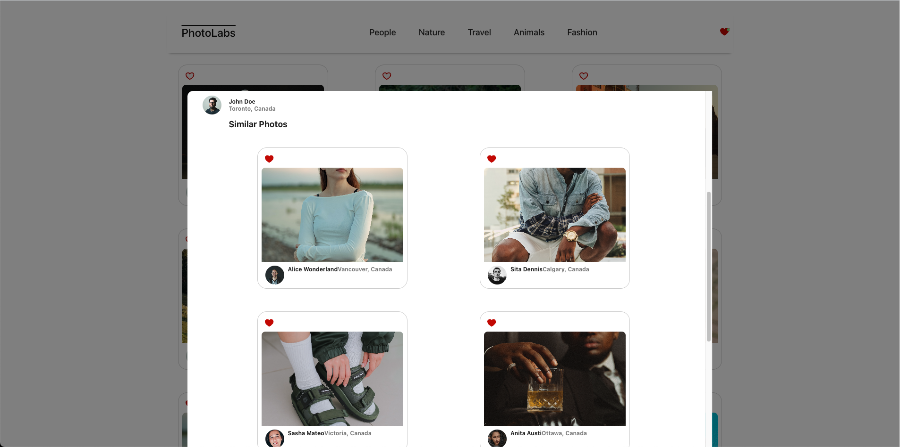

# Photolabs

A single page full stack React web application where users can view, sort and, like photos.

## Screenshots




## Setup

Install dependencies with `npm install` in each respective `/frontend` and `/backend`.

## [Frontend] Running Webpack Development Server

```sh
cd frontend
npm start
```

## [Backend] Running Backend Servier

Read `backend/readme` for further setup details.

```sh
cd backend
npm start
```

## Frontend Dependencies

- React
- React Dom
- React Scripts
- Sass
- SQL

---

## Backend Dependencies

- Body Parser
- Cors
- Dotenv
- Express
- Helmet
- PG
- Socket-io
